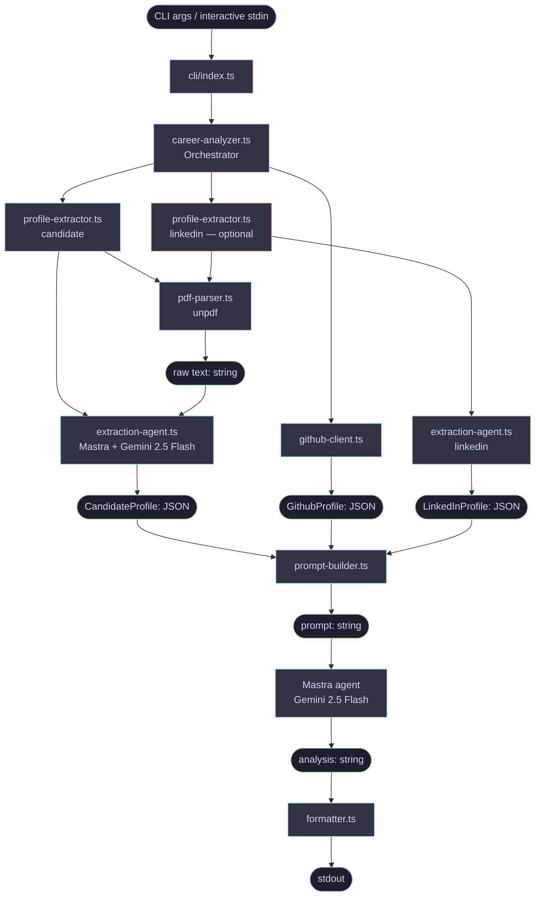

# AscentX — Architecture Document

## Overview

AscentX Career Architect is a CLI tool that audits a developer's public presence
by cross-referencing their resume, GitHub portfolio, optional LinkedIn export, and
career goal. It produces a structured analysis powered by an LLM, identifying
skill gaps and proposing a concrete "Hero Project" to bridge them.

This document covers the PoC scope: local execution, CLI interface, PDF resume
and LinkedIn input, GitHub API data retrieval, and Gemini as the initial AI provider.

---

## Technology Stack

| Concern             | Technology                        |
| ------------------- | --------------------------------- |
| Language            | TypeScript                        |
| Runtime             | Node.js + tsx                     |
| CLI parsing         | commander                         |
| PDF extraction      | unpdf                             |
| GitHub data         | @octokit/graphql                  |
| Agent orchestration | @mastra/core                      |
| AI provider (PoC)   | @ai-sdk/google (Gemini 2.5 Flash) |
| Schema validation   | zod                               |
| Environment config  | dotenv                            |
| Testing             | vitest + @vitest/coverage-v8      |

---

## Project Structure

```
ascentxai/
├── src/
│   ├── cli/
│   │   └── index.ts                  # Entry point, argument parsing, interactive fallback
│   ├── mastra.ts                     # Central Mastra instance (agent registry)
│   ├── modules/
│   │   ├── candidate/
│   │   │   ├── pdf-parser.ts             # PDF -> raw text (unpdf); shared with LinkedIn
│   │   │   ├── extraction-agent.ts       # Mastra agent bound to Gemini 2.5 Flash
│   │   │   └── profile-extractor.ts      # Service: PDF -> validated CandidateProfile
│   │   ├── github/
│   │   │   ├── github-client.ts          # GitHub GraphQL API client
│   │   │   ├── github-queries.ts         # GraphQL query strings
│   │   │   └── github-mapper.ts          # Raw response -> GithubRepo mapper
│   │   ├── linkedin/
│   │   │   ├── extraction-agent.ts       # Mastra agent tuned for LinkedIn PDF layout
│   │   │   └── profile-extractor.ts      # Service: PDF -> validated LinkedInProfile
│   │   └── analyzer/
│   │       ├── prompt-builder.ts         # Structured prompt assembly (3 or 4 data sources)
│   │       └── career-analyzer.ts        # End-to-end orchestrator
│   ├── types/
│   │   ├── github/
│   │   │   ├── github.ts                 # Public GithubProfile + GithubRepo Zod schemas
│   │   │   └── github-response.ts        # Raw GraphQL response validation schemas
│   │   ├── candidate/
│   │   │   └── profile.ts                # CandidateProfile Zod schema + inferred type
│   │   └── linkedin/
│   │       └── linkedin-profile.ts       # LinkedInProfile Zod schema + inferred type
│   └── output/
│       └── formatter.ts                  # Terminal text rendering (planned)
├── scripts/
│   ├── github-test.ts                    # Manual GitHub client harness
│   ├── extract-resume.ts                 # Manual resume extraction harness
│   ├── extract-linkedin.ts               # Manual LinkedIn extraction harness
│   └── analyze.ts                        # Manual end-to-end analysis harness
├── tests/
│   └── modules/
│       ├── candidate/
│       │   ├── fixtures/profile.fixture.ts
│       │   ├── pdf-parser.test.ts
│       │   ├── profile-extractor.test.ts
│       │   └── profile-schema.test.ts
│       ├── github/
│       │   ├── fixtures/
│       │   │   ├── profile.fixture.ts
│       │   │   └── repo.fixture.ts
│       │   └── github-client.test.ts
│       ├── linkedin/
│       │   ├── fixtures/profile.fixture.ts
│       │   └── profile-extractor.test.ts
│       └── analyzer/
│           ├── career-analyzer.test.ts
│           └── prompt-builder.test.ts
├── .env                                  # GOOGLE_GENERATIVE_AI_API_KEY, GITHUB_TOKEN
├── package.json
├── tsconfig.json
└── vitest.config.ts
```

---

## Implementation Status

| Module                              | Status      |
| ----------------------------------- | ----------- |
| `candidate/pdf-parser.ts`           | ✅ Complete |
| `candidate/extraction-agent.ts`     | ✅ Complete |
| `candidate/profile-extractor.ts`    | ✅ Complete |
| `types/candidate/profile.ts`        | ✅ Complete |
| `github/github-client.ts`           | ✅ Complete |
| `github/github-queries.ts`          | ✅ Complete |
| `github/github-mapper.ts`           | ✅ Complete |
| `types/github/github.ts`            | ✅ Complete |
| `types/github/github-response.ts`   | ✅ Complete |
| `linkedin/extraction-agent.ts`      | ✅ Complete |
| `linkedin/profile-extractor.ts`     | ✅ Complete |
| `types/linkedin/linkedin-profile.ts`| ✅ Complete |
| `mastra.ts`                         | ✅ Complete |
| `analyzer/prompt-builder.ts`        | ✅ Complete |
| `analyzer/career-analyzer.ts`       | ✅ Complete |
| `output/formatter.ts`               | ⬜ Planned  |
| `cli/index.ts`                      | ⬜ Planned  |

---

## Data Flow



---

## Module Definitions

### `src/cli/index.ts` _(planned)_

**Responsibility:** Entry point of the application. Parses CLI arguments and
handles the interactive fallback for the `--goal` flag.

**Inputs:**

- `--resume <path>` — Absolute or relative path to the PDF resume file
- `--github <username>` — GitHub username to audit
- `--linkedin <path>` — Optional LinkedIn PDF export
- `--goal "<role>"` — Target role or professional level (optional flag)

**Behavior:**

- If `--goal` is provided as a flag, it is used directly.
- If `--goal` is omitted, the CLI prompts the user interactively via stdin.
- Validates that `--resume` file exists and is a `.pdf` before proceeding.
- Calls `analyze()` and pipes the result to `render()`.

**Dependencies:** `commander`, `readline` (Node built-in), `career-analyzer.ts`,
`formatter.ts`

---

### `src/modules/candidate/pdf-parser.ts`

**Responsibility:** Extracts raw text content from a PDF file. Shared by both
the candidate resume and LinkedIn extraction pipelines.

**Exports:**

```typescript
async function parsePdfFromPath(filePath: string): Promise<string>;
async function parsePdfFromBuffer(buffer: Buffer | Uint8Array): Promise<string>;
```

**Behavior:**

- Reads the file from the given path using `fs/promises`.
- Validates the `.pdf` extension before reading.
- Extracts and returns all text content as a single plain string via `unpdf`.
- Throws a typed error if the file is not found, extension is wrong, or text is empty.

**No analysis logic lives here.** This module is strictly an I/O adapter.

**Dependencies:** `unpdf`

---

### `src/modules/github/github-client.ts`

**Responsibility:** Fetches public portfolio data for a given GitHub username
using the GitHub GraphQL API. REST is not used because pinned repositories are
only exposed via GraphQL.

**Exports:**

```typescript
async function fetchProfile(username: string): Promise<GithubProfile>;
async function fetchRepo(owner: string, repo: string): Promise<GithubRepo>;
async function fetchRepoBySlug(slug: string): Promise<GithubRepo>; // parses "owner/repo"
```

**Types (Zod-inferred, from `src/types/github/github.ts`):**

```typescript
type GithubRepo = {
    name: string;
    description: string | null;
    primaryLanguage: string | null;
    url: string;
    readme: string | null;
};

type GithubProfile = {
    username: string;
    name: string | null;
    bio: string | null;
    location: string | null;
    company: string | null;
    websiteUrl: string | null;
    avatarUrl: string;
    followers: number;
    following: number;
    pinnedRepos: GithubRepo[];
};
```

**Behavior:**

- Queries pinned repositories (up to 6) for the given username.
- For each repository, fetches name, description, primary language, URL, and README
  content (from the default branch HEAD).
- Returns a typed `GithubProfile` with all pinned repos populated.
- Throws a typed error if the username or repo is not found.

**Dependencies:** `@octokit/graphql`

**Environment variable required:** `GITHUB_TOKEN`

---

### `src/modules/linkedin/extraction-agent.ts`

**Responsibility:** Mastra agent that extracts structured data from a LinkedIn
PDF export.

LinkedIn PDFs have a predictable section order (About, Experience, Education,
Skills, Recommendations, etc.) with three extraction requirements that differ
from resume extraction:

1. **Endorsed skill counts** — listed separately from the aggregated skills
   taxonomy so downstream prompts can weight them as social proof.
2. **Recommendations** — verbatim text, never paraphrased.
3. **Connection count** — normalized from "500+" to the numeric floor `500`.

**Model:** `gemini-2.5-flash` (configurable via `GOOGLE_GENERATIVE_AI_MODEL`)
**Temperature:** `0`

---

### `src/modules/linkedin/profile-extractor.ts`

**Responsibility:** Public service that converts a LinkedIn PDF export into a
validated `LinkedInProfile`.

**Exports:**

```typescript
async function extractLinkedInProfile(
    input: { filePath: string } | { buffer: Buffer | Uint8Array }
): Promise<LinkedInProfile>;
```

**Behavior:**

1. Accepts either a file path or a raw buffer.
2. Calls `parsePdfFromPath` or `parsePdfFromBuffer` from the shared candidate
   pdf-parser — the LinkedIn export is a standard PDF, so no separate parser
   is needed.
3. Validates `GOOGLE_GENERATIVE_AI_API_KEY` is set.
4. Invokes `linkedinExtractionAgent.generate()` with the PDF text and today's
   date injected for duration calculations.
5. Validates the agent output against `linkedinProfileSchema` (Zod).
6. Returns the typed `LinkedInProfile`.

---

### `src/mastra.ts` and extraction agents

**Responsibility:** LLM integration for structured extraction.

- `src/mastra.ts` exports the central `Mastra` instance and registers all
  agents — it is the single lookup point for the rest of the app.
- `candidateExtractionAgent` — extracts `CandidateProfile` from resume text.
- `linkedinExtractionAgent` — extracts `LinkedInProfile` from LinkedIn PDF text.
- `careerAnalysisAgent` — produces the free-text career analysis from the
  assembled prompt.

**Provider swap:** to use a different model, change the `model:` binding on
the agent (`openai(...)`, `anthropic(...)`, etc.) — no factory needed.

**Environment variables:**

- `GOOGLE_GENERATIVE_AI_API_KEY` (required, read by `@ai-sdk/google`)
- `GOOGLE_GENERATIVE_AI_MODEL` (optional, defaults to `gemini-2.5-flash`)

---

### `src/modules/candidate/profile-extractor.ts`

**Responsibility:** Public service that converts a PDF resume into a validated
`CandidateProfile`.

**Exports:**

```typescript
async function extractCandidateProfile(input: {
    filePath?: string;
    buffer?: Buffer | Uint8Array;
}): Promise<CandidateProfile>;
```

**Behavior:**

1. Accepts either a file path or a raw buffer.
2. Calls `parsePdfFromPath` or `parsePdfFromBuffer` to get raw text.
3. Validates `GOOGLE_GENERATIVE_AI_API_KEY` is set.
4. Invokes `candidateExtractionAgent.generate()` with the resume text and
   today's date for duration calculations.
5. Validates the agent output against `candidateProfileSchema` (Zod).
6. Returns the typed `CandidateProfile`.

---

### `src/modules/analyzer/prompt-builder.ts`

**Responsibility:** Assembles the structured prompt sent to the AI provider.
Accepts an optional `LinkedInProfile` that, when present, adds a fourth data
source section and LinkedIn-specific cross-check instructions.

**Exports:**

```typescript
function buildPrompt(
    profile: CandidateProfile,
    portfolio: GithubProfile,
    goal: string,
    linkedinProfile?: LinkedInProfile | null
): string;

function formatLinkedInProfile(profile: LinkedInProfile): string;
```

**Behavior:**

- Opens with the AscentX system role preamble.
- Serializes `CandidateProfile`: top skills, full skill taxonomy, roles with
  tech stacks and duration, education.
- Serializes `GithubProfile`: username, bio, followers, repo name + primary
  language + description + README excerpt (first 600 chars, truncated with `…`).
- When `linkedinProfile` is provided:
  - Adds a `=== LINKEDIN PROFILE ===` section with endorsed skills (with peer
    counts), recommendations (verbatim), courses, and volunteer experience.
  - Adds instructions to cross-check endorsement counts against resume
    `topSkills` and flag discrepancies.
  - Numbers the data sources list as 1–4 instead of 1–3.
- Injects the goal under `=== CAREER GOAL ===`.
- Appends `=== INSTRUCTIONS ===` block with three verbatim output headings.
- Response capped at 600 words in the instructions.
- **No AI calls are made here.** This module is a pure string builder.

---

### `src/modules/analyzer/career-analyzer.ts`

**Responsibility:** Main orchestrator. Coordinates all modules in parallel and
returns the final analysis string.

**Exports:**

```typescript
async function analyze(
    resumePath: string,
    githubUsername: string,
    goal: string,
    linkedinPath?: string
): Promise<string>;
```

**Behavior:**

1. Runs in parallel via `Promise.all`:
   - `extractCandidateProfile({ filePath: resumePath })` → `profile`
   - `fetchProfile(githubUsername)` → `portfolio`
   - `extractLinkedInProfile({ filePath: linkedinPath })` → `linkedinProfile`
     (or `null` if `linkedinPath` is not provided)
2. Calls `buildPrompt(profile, portfolio, goal, linkedinProfile)` → `prompt`
3. Runs `careerAnalysisAgent` with the prompt → `analysis: string`
4. Returns the raw analysis string.

**No formatting logic lives here.** Output rendering is delegated to
`formatter.ts`.

---

### `src/output/formatter.ts` _(planned)_

**Responsibility:** Renders the AI analysis string to the terminal with clear
section structure.

**Exports:**

```typescript
function render(analysis: string): void;
```

**Behavior:**

- Prints a header block identifying the tool and run timestamp.
- Prints the analysis content with section separators for readability.
- Writes directly to `process.stdout`.
- No transformation of analysis content — output is rendered as received.

---

## Candidate and LinkedIn Extraction Pipelines (Mastra + Gemini)

Both extraction pipelines follow the same pattern: PDF → raw text → Mastra
agent → Zod-validated JSON record. They share the `pdf-parser` I/O adapter
and differ only in agent instructions and output schema.

### Candidate pipeline design choices

- **Per-role technologies.** Each role carries its own `technologies` list
  and `yearsInRole`, enabling cross-referencing against GitHub repository
  primary languages.
- **Normalized skill taxonomy.** The agent emits canonical names
  (`JavaScript`, not `JS`; `PostgreSQL`, not `Postgres`) matching GitHub's
  `primaryLanguage` values directly.
- **Two experience numbers.** `yearsInRole` per role AND
  `totalYearsOfExperience` as the non-overlapping sum — overlapping roles
  are counted only once in the total.

### LinkedIn pipeline design choices

- **Endorsed skills kept separate** from the aggregated skill taxonomy so
  downstream prompts can weight them as social proof independently.
- **Recommendations are verbatim** — the agent is instructed not to
  paraphrase, preserving the qualitative signal for the analysis.
- **Connections normalized** — LinkedIn shows "500+"; the agent extracts the
  numeric floor (`500`).

### Flow (shared)

```
PDF file / buffer
   |
   v
unpdf (pdf-parser.ts)   --> raw text string
   |
   v
Mastra Agent (candidateExtractionAgent | linkedinExtractionAgent)
   - model: @ai-sdk/google -> gemini-2.5-flash
   - temperature: 0
   - generateObject({ schema: candidateProfileSchema | linkedinProfileSchema })
   |
   v
Zod validation
   |
   v
CandidateProfile | LinkedInProfile (structured JSON)
```

### Key files

| File                                           | Responsibility                              |
| ---------------------------------------------- | ------------------------------------------- |
| `src/types/candidate/profile.ts`               | Zod schema + inferred `CandidateProfile`    |
| `src/types/linkedin/linkedin-profile.ts`       | Zod schema + inferred `LinkedInProfile`     |
| `src/modules/candidate/pdf-parser.ts`          | Shared PDF → text adapter (path or buffer)  |
| `src/modules/candidate/extraction-agent.ts`    | Mastra agent for resume extraction          |
| `src/modules/linkedin/extraction-agent.ts`     | Mastra agent for LinkedIn PDF extraction    |
| `src/mastra.ts`                                | Central `Mastra` instance registration      |
| `src/modules/candidate/profile-extractor.ts`   | Public service: resume PDF → validated JSON |
| `src/modules/linkedin/profile-extractor.ts`    | Public service: LinkedIn PDF → validated JSON |
| `scripts/extract-resume.ts`                    | Manual harness for resume extraction        |
| `scripts/extract-linkedin.ts`                  | Manual harness for LinkedIn extraction      |

---

## Environment Variables

All secrets and configuration are stored in `.env` at the project root.

```
GOOGLE_GENERATIVE_AI_API_KEY=your_gemini_api_key
GOOGLE_GENERATIVE_AI_MODEL=gemini-2.5-flash    # optional, this is the default
GITHUB_TOKEN=your_github_personal_access_token
```

`GOOGLE_GENERATIVE_AI_API_KEY` is read by `@ai-sdk/google` inside all three
Mastra-driven pipelines. `GITHUB_TOKEN` authenticates the GraphQL client in
`src/modules/github/github-client.ts`.

`.env` must never be committed to version control.

---

## CLI Usage

**Analysis — resume + GitHub:**

```bash
npm run analyze -- ./resume.pdf johndoe "Staff Engineer at a B2B SaaS company"
```

**Analysis — resume + GitHub + LinkedIn:**

```bash
npm run analyze -- ./resume.pdf johndoe ./linkedin.pdf "Staff Engineer at a B2B SaaS company"
```

The script detects the LinkedIn path by checking whether the third positional
argument ends with `.pdf`.

**Manual testing scripts:**

```bash
# Test GitHub client
npm run github:test profile <username>
npm run github:test repo <owner/repo>

# Test resume extraction
npm run resume:extract -- <path-to-resume.pdf>

# Test LinkedIn extraction
npm run linkedin:extract -- <path-to-linkedin.pdf>
```

---

## Error Handling Strategy

Each module throws typed, descriptive errors. The CLI entry point (`cli/index.ts`)
is the single catch boundary — it handles all errors, prints a human-readable
message to `stderr`, and exits with a non-zero code.

| Error origin              | Example message                                                      |
| ------------------------- | -------------------------------------------------------------------- |
| `pdf-parser`              | `Expected a .pdf file, received: ./resume.docx`                      |
| `pdf-parser`              | `File not found: ./missing.pdf`                                      |
| `github-client`           | `GitHub user "johndoe" not found`                                    |
| `github-client`           | `GitHub API error: ...`                                              |
| `profile-extractor`       | `GOOGLE_GENERATIVE_AI_API_KEY is not set. Add it to your .env file.` |
| `profile-extractor`       | Zod validation error when the agent returns a malformed profile      |
| `linkedin/profile-extractor` | Same API key and Zod errors as candidate extractor               |
| `career-analyzer`         | `Career analysis agent returned an empty response.`                  |

---

## Extensibility Notes

- **New AI model / provider:** Change the `model:` binding on the Mastra
  agent (e.g. `openai('gpt-4o')`, `anthropic('claude-sonnet-4-7')`). No
  factory file required — the Vercel AI SDK handles the switch.
- **New input format (e.g., DOCX resume):** Add a new parser in
  `src/modules/candidate/` and route to it from `profile-extractor.ts`
  based on file extension.
- **New data source (e.g., Stack Overflow, personal site):** Add a module
  under `src/modules/`, define a Zod schema in `src/types/`, register the
  agent in `mastra.ts`, and add an optional parameter to `analyze()` and
  `buildPrompt()`.
- **Persistence layer:** Insert a storage step inside the extractor (or as
  a downstream Mastra workflow) after the profile is validated.
- **Web/API interface:** Both `extractCandidateProfile` and
  `extractLinkedInProfile` accept buffers, so they can be wired directly to
  an Express or Next.js upload handler.
